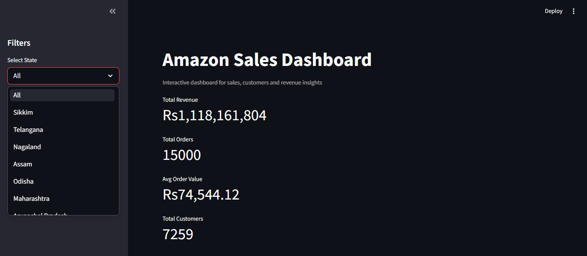
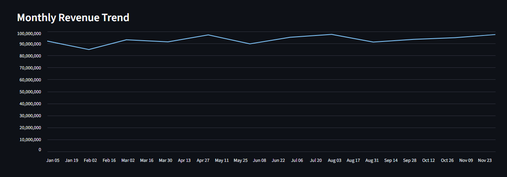
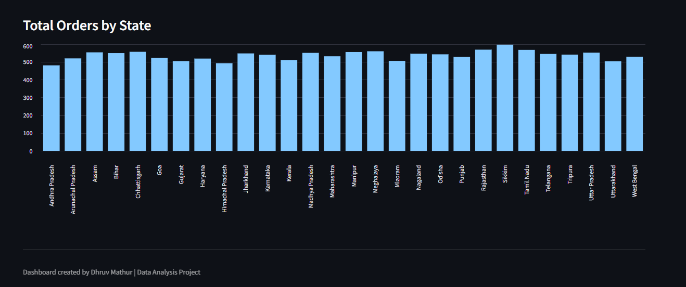
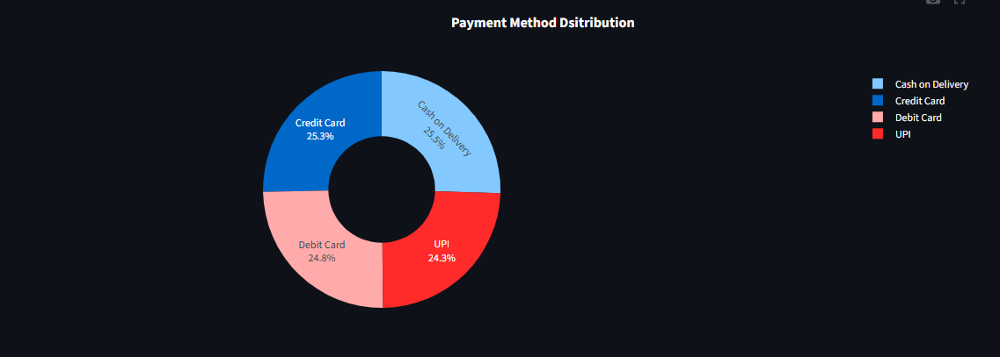
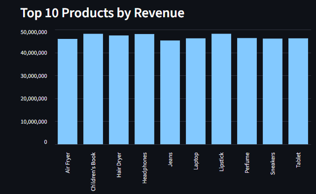
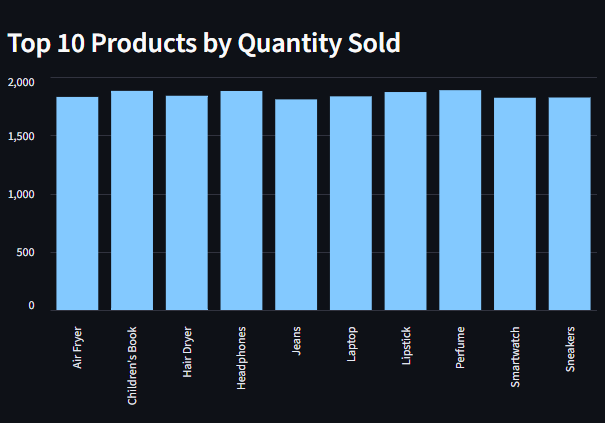
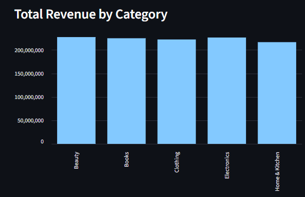
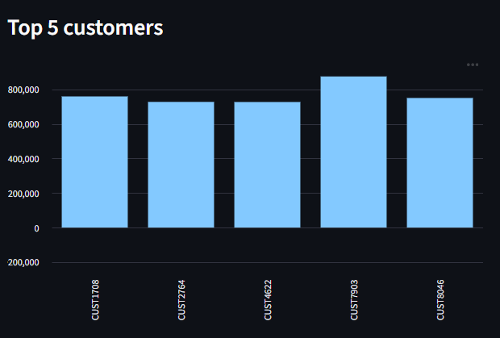

# 🛒 E-commerce Sales Exploratory Data Analysis

## 📌 Project Overview

This project performs a comprehensive Exploratory Data Analysis (EDA) on an E-commerce Sales dataset using SQL and Python. The objective is to understand customer purchasing behavior, sales performance, revenue trends, payment preferences, and product insights through interactive visualizations and business-driven analysis.

The project follows a complete data analysis workflow including data cleaning, SQL database integration, exploratory analysis, and dashboard creation using Plotly.

---

## 🎯 Objectives

- Analyze overall sales performance.
- Identify top-selling products and categories.
- Understand customer purchasing patterns.
- Explore regional sales distribution.
- Analyze payment method preferences.
- Build an interactive business dashboard.

---

## 🛠️ Technologies Used

- Python
- SQL (SQLite)
- Pandas
- NumPy
- Plotly
- Matplotlib
- Jupyter Notebook

---

## 📊 Dashboard Visualizations

The interactive dashboard includes:

- 📈 Monthly Revenue Trend
- 🛍️ Product-wise Revenue Analysis
- 📦 Product-wise Quantity Sold
- 🗺️ Orders by State
- 💳 Payment Method Distribution
- 🏷️ Revenue by Category
- 👥 Top Customers
- 📊 Complete Interactive Dashboard

---

## 📁 Project Structure

```
Ecommerce Sales EDA/
│
├── assets/
│   ├── dashboard_display1.png
│   ├── monthly_revenue_trend.png
│   ├── order_by_state.png
│   ├── payment_pie.png
│   ├── product_by_quantity.png
│   ├── product_by_revenue.png
│   ├── revenue_by_category.png
│   └── top_customers.png
│
├── data/
│   └── amazon_sales_2025_INR.csv
│
├── databases/
│   └── ecommerce_sales.db
│
├── notebooks/
│   └── E-Commerce Project.ipynb
│
├── dashboard.py
├── README.md
├── requirements.txt
└── .gitignore
```

---

## 📸 Project Screenshots

### Dashboard



---

### Monthly Revenue Trend



---

### Orders by State



---

### Payment Method Distribution



---

### Product-wise Revenue



---

### Product-wise Quantity Sold



---

### Revenue by Category



---

### Top Customers



---

## 📈 Key Insights

- Monthly revenue trends reveal seasonal business performance.
- Certain products contribute significantly to total revenue.
- Customer purchasing behavior varies across regions.
- Payment method distribution highlights customer preferences.
- Category-wise analysis identifies high-performing business segments.
- Interactive dashboards make business insights easy to explore.

---

## 📚 Skills Demonstrated

- Data Cleaning
- Exploratory Data Analysis (EDA)
- SQL Database Integration
- Data Visualization
- Business Insight Generation
- Interactive Dashboard Development
- Python Programming

---

## 👨‍💻 Author

**Dhruv Mathur**

B.Tech Computer Science & Engineering

GitHub: https://github.com/Dhruv-Mathur05

---

## 🤝 Support

If you found this project helpful or learned something from it:

⭐ Star this repository

🍴 Fork the repository

📝 Share your feedback or suggestions by opening an Issue

Your support is greatly appreciated and motivates me to build more real-world data analysis and machine learning projects.
